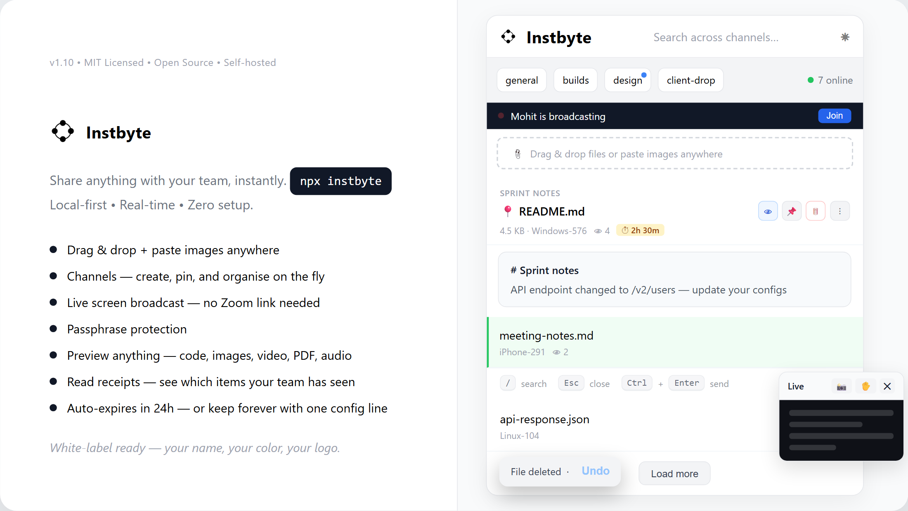

<p align="center">
  
</p>

<h1 align="center">Instbyte</h1>

<p align="center">
  <a href="https://www.npmjs.com/package/instbyte"></a>
  <a href="https://github.com/mohitgauniyal/instbyte/blob/main/LICENSE">
  
</a>
</p>

---

<p align="center">
  
</p>

```bash
npx instbyte
```

**Instbyte** is a high-speed, real-time, short-lived LAN sharing utility built for teams and developers who need to move snippets, links, files, and structured notes across devices instantly — without cloud accounts, logins, or external services.

It operates entirely on your local network, acting as a lightweight "digital dead-drop" for frictionless collaboration.

Instbyte can also be fully white-labelled — the difference between ***a tool you use*** and ***a tool you own***.

---

## Install & Run

**Requires Node.js 18 or higher.**

The fastest way — no installation needed:
```bash
npx instbyte
```

Or install globally and run from anywhere:
```bash
npm install -g instbyte
instbyte
```
Data and config live in the directory you run the command from. To keep a permanent instance, always run from the same folder or use a process manager like pm2.

That's it. Open the displayed URL in any browser on the same network.

---

## How It Works

One person runs the server — everyone else on the same WiFi opens the URL in their browser. No accounts, no setup on client devices.

```
[Your Machine] — runs: npx instbyte
                        ↓
               http://192.168.x.x:3000
                        ↓
   [Phone] [Laptop] [Tablet] — open URL in browser
```

**Sharing is instant:**
- Type or paste text → hit Send
- Paste anywhere on the page → auto-sends text or uploads images directly
- Drag a file anywhere onto the page → uploads
- Click any text item → copies to clipboard
- Click any file item → downloads

Everything syncs in real time across all connected devices. Content auto-deletes after 24 hours.

---

## For Teams

### Quick Setup (No Config)
Run `npx instbyte` on the machine that will act as the server. Share the displayed network URL with your team. Done.

### With Config File
For teams who want auth, custom retention, or branding — create `instbyte.config.json` in the directory where you run the command:

```json
{
  "server": {
    "port": 3000
  },
  "auth": {
    "passphrase": "yourteampassword"
  },
  "storage": {
    "maxFileSize": "2GB",
    "retention": "24h"
  },
  "branding": {
    "appName": "Team Hub",
    "primaryColor": "#7c3aed",
    "logoPath": "./logo.png"
  }
}
```

Then run `npx instbyte` in the same directory. The config is picked up automatically.

### Keeping It Running
For persistent team use, run it as a background process:

```bash
# using pm2
npm install -g pm2
pm2 start "npx instbyte" --name instbyte
pm2 save
```

Or use any process manager you already have — systemd, screen, tmux.

---

## Docker

The fastest way to run Instbyte with Docker:
```bash
docker compose up -d
```

Or with plain Docker:
```bash
docker run -d \
  -p 3000:3000 \
  -v $(pwd)/instbyte-data:/data \
  -e INSTBYTE_DATA=/data \
  -e INSTBYTE_UPLOADS=/data/uploads \
  --name instbyte \
  mohitgauniyal/instbyte
```

Data persists in `./instbyte-data` on your host. The same folder used by `npx instbyte` — so switching between the two preserves all your data.

### With a config file

Mount your config file into the container:
```yaml
services:
  instbyte:
    image: mohitgauniyal/instbyte
    ports:
      - "3000:3000"
    volumes:
      - ./instbyte-data:/data
      - ./instbyte.config.json:/app/instbyte.config.json
    environment:
      - INSTBYTE_DATA=/data
      - INSTBYTE_UPLOADS=/data/uploads
    restart: unless-stopped
```

### Changing the port

Edit the host port in `docker-compose.yml`:
```yaml
ports:
  - "8080:3000"  # now runs on port 8080
```

> **Note:** File uploads may not work correctly on Windows Docker Desktop due to network limitations. For Windows, use `npx instbyte` directly or deploy on a Linux server.

---

## Reverse Proxy

For teams who want to access Instbyte over HTTPS or from outside their local network, running it behind a reverse proxy is the standard approach.

> **Important:** Instbyte uses WebSockets for real-time sync. Your proxy must be configured to forward WebSocket connections — otherwise the app will load but live updates will stop working.

### Nginx
```nginx
server {
    listen 80;
    server_name instbyte.yourdomain.com;

    # Redirect HTTP to HTTPS
    return 301 https://$host$request_uri;
}

server {
    listen 443 ssl;
    server_name instbyte.yourdomain.com;

    ssl_certificate     /etc/letsencrypt/live/instbyte.yourdomain.com/fullchain.pem;
    ssl_certificate_key /etc/letsencrypt/live/instbyte.yourdomain.com/privkey.pem;

    # Increase max upload size to match Instbyte's limit
    client_max_body_size 2G;

    location / {
        proxy_pass http://localhost:3000;
        proxy_http_version 1.1;

        # Required for WebSocket support
        proxy_set_header Upgrade $http_upgrade;
        proxy_set_header Connection "upgrade";

        proxy_set_header Host $host;
        proxy_set_header X-Real-IP $remote_addr;
        proxy_set_header X-Forwarded-For $proxy_add_x_forwarded_for;
        proxy_set_header X-Forwarded-Proto $scheme;

        # Prevent proxy timeouts on large uploads
        proxy_read_timeout 300s;
        proxy_send_timeout 300s;
    }
}
```

Get a free SSL certificate with Certbot:
```bash
certbot --nginx -d instbyte.yourdomain.com
```

### Caddy

Caddy automatically handles HTTPS certificates — no Certbot needed.
```caddy
instbyte.yourdomain.com {
    reverse_proxy localhost:3000
}
```

Caddy handles WebSocket forwarding and HTTPS automatically. That's all you need.

### With Docker

If running Instbyte via Docker, proxy to the mapped host port:
```nginx
proxy_pass http://localhost:3000;
```

Or use Docker's internal network — replace `localhost` with the container name:
```nginx
proxy_pass http://instbyte:3000;
```

### Keeping it LAN-only

If you don't want external access but still want HTTPS on your local network, tools like [Tailscale](https://tailscale.com) or [Cloudflare Tunnel](https://developers.cloudflare.com/cloudflare-one/connections/connect-networks/) are good options that require no open ports.

---

## Configuration

Instbyte works out of the box with zero configuration. All options are optional — only include what you want to override.

| Key | Default | Description |
|---|---|---|
| `server.port` | `3000` | Port to run on. Overridden by `PORT` env var if set |
| `auth.passphrase` | `""` | Shared passphrase for access. Empty = no auth |
| `storage.maxFileSize` | `"2GB"` | Max upload size. Accepts `KB`, `MB`, `GB` |
| `storage.retention` | `"24h"` | How long before items auto-delete. Accepts `h`, `d`, or `"never"` to disable cleanup entirely |
| `branding.appName` | `"Instbyte"` | App name in header and browser tab |
| `branding.primaryColor` | `"#111827"` | Primary brand color in hex. Full palette auto-derived |
| `branding.logoPath` | — | Path to your logo file relative to where you run the command |
| `branding.faviconPath` | — | Path to custom favicon. Auto-generated from logo if omitted |

---

## Branding

Instbyte can be fully white-labelled — no code changes required. Set a name, a color, and a logo and the entire UI updates automatically including the login page, favicon, buttons, and active states.

```json
{
  "branding": {
    "appName": "Team Hub",
    "primaryColor": "#7c3aed",
    "logoPath": "./my-logo.png"
  }
}
```

The difference between *a tool you use* and *a tool you own.*

---

## Features

**Real-time sync** — every action is instantly reflected across all connected devices via WebSockets.

**Channels** — organise shared content into named channels. Create, rename, pin, and delete channels on the fly. Pinned channels are protected from accidental deletion.

**Rich content** — markdown rendering, syntax highlighting for code, inline image preview, video and audio playback, PDF preview, and text file viewing — all without downloading.

**Search** — full-text search across all channels.

**Smart port handling** — if port 3000 is busy, Instbyte finds the next available port automatically.

**Short-lived by design** — content auto-deletes after 24 hours by default. Configure retention per your needs, or disable cleanup entirely.

**QR join** — built-in QR code so phones can join instantly without typing the URL.

**Dark mode** — follows system preference automatically. Override with the toggle in the header.

**Undo delete** — recover accidentally removed items instantly before they’re gone.

**New drop alerts** — get a notification sound when something is added in your current channel and visual indicators for activity in others.

**Presence awareness** — see how many people are currently connected in real time.

**Live broadcast** — share your screen in real time with everyone on the network. Viewers join instantly from their browser, no plugins or installs needed. Built on WebRTC for smooth, low-latency video. Includes mic audio, viewer mute/unmute, raise hand, and screen capture to channel.

**Read receipts** — see how many devices have viewed each shared item. Updates live as teammates open the page.

**Item management** — add optional titles to label any item for future reference. Edit text items inline without deleting and re-pasting. Pinned items are protected from both manual deletion and auto-cleanup.

**Mobile ready** — install as a PWA directly from your browser. Add to Home Screen on iOS or Android for a native app feel without the App Store.

**Security hardened** — rate limiting on all write endpoints, magic number file validation, filename sanitisation, and forced download for executable file types.

---

## Broadcasting

One person shares their screen — everyone else on the network watches live in their browser. No plugins, no accounts, no external services. Built on WebRTC for smooth, low-latency video.

### How to broadcast

Click **📡 Broadcast** in the composer. Your browser will ask you to choose a screen, window, or tab to share. Once you pick one, a live bar appears at the top for all connected devices — teammates click **Join** to watch.

While broadcasting you can still use Instbyte normally — send text, drop files, switch channels. The broadcast runs in the background.

To stop, click **⏹ Stop** in the composer or use the browser's built-in "Stop sharing" bar.

### As a viewer

When a broadcast is live, a bar appears at the top of the page. Click **Join** to open the viewer panel. The panel is draggable and resizable — move it anywhere on your screen.

- **📸 Capture** — saves the current frame as an image to the active channel
- **✋ Raise hand** — notifies the broadcaster with a sound and toast
- **🔇 / 🔊** — mute and unmute audio
- **─** — minimize the panel without leaving the broadcast
- **✕** — leave the broadcast entirely

### Audio

Instbyte captures your microphone alongside the screen share by default. Viewers are muted on join — click 🔇 to unmute.

To share audio playing on your screen (videos, music, system sounds), select a **browser tab** in the screen picker and enable **Share tab audio**. Window and full-screen capture do not carry system audio — this is a browser limitation.

### HTTPS requirement

Broadcasting uses `getDisplayMedia` which browsers only allow on secure connections. This means:

- **localhost** — always works. If you run `npx instbyte` on your own machine and open `http://localhost:3000`, you can broadcast.
- **LAN via HTTP** — viewers can watch but cannot broadcast themselves. Only the person running the server can broadcast.
- **LAN via HTTPS** — everyone on the network can broadcast.

### Enabling broadcast for everyone on your network

To let any device on your LAN broadcast, run Caddy alongside Instbyte. Caddy adds HTTPS automatically — no certificate setup needed.

**Install Caddy:**
```bash
# macOS
brew install caddy

# Ubuntu / Debian
sudo apt install caddy
```

**Run alongside Instbyte:**
```bash
# Terminal 1
npx instbyte

# Terminal 2 — replace with your machine's local IP
caddy reverse-proxy --from https://192.168.1.x --to localhost:3000
```

Everyone on the network opens `https://192.168.1.x` instead of the plain HTTP URL. The first visit on each device will show a certificate warning — click **Advanced → Proceed**. After that, full HTTPS, anyone can broadcast.

For a permanent setup with a real domain, see the [Reverse Proxy](#reverse-proxy) section.

### Advanced: broadcast across subnets or over the internet

WebRTC peer connections work natively on a LAN without any relay server. If you're running Instbyte on a VPS or across different subnets, WebRTC needs a TURN relay to punch through NAT.

Install and run [coturn](https://github.com/coturn/coturn) on your server:
```bash
sudo apt install coturn
```

Minimal `/etc/turnserver.conf`:
```
listening-port=3478
fingerprint
lt-cred-mech
user=instbyte:yourpassword
realm=yourdomain.com
```

Then update the STUN_SERVERS config in `client/js/app.js` to point to your TURN server. Teams doing this are already comfortable with server config — the coturn docs cover the rest.
```

---

## Keyboard Shortcuts

| Key | Action |
|---|---|
| `/` | Focus search |
| `Escape` | Close previews, menus, or blur input |
| `Ctrl/Cmd + Enter` | Send message |
| `Ctrl/Cmd + K` | Jump to message input |
| `Tab` | Cycle channels |

---

## Manual / Self-hosted from Source

```bash
git clone https://github.com/mohitgauniyal/instbyte
cd instbyte
npm install
node server/server.js
```

---

## Use Cases

- Moving content between your phone and laptop, or just any device over WiFi
- Sharing API payloads, logs, or screenshots during a sprint
- A lightweight team clipboard during standups or pair sessions
- Home lab file sharing without setting up NAS or cloud sync
- Piping build logs or stack traces from CI or terminal directly into a shared channel
- Sharing sensitive credentials or config files over LAN without leaving a cloud trail
- Live screen sharing during standups, design reviews, or debugging sessions — no Zoom link needed

---

## Terminal Usage

Since Instbyte exposes a simple HTTP API, you can push content directly from your terminal using `curl` — no browser needed.

**Send a log file:**
```bash
curl -X POST http://192.168.x.x:3000/text \
  -H "Content-Type: application/json" \
  -d "{\"content\": \"$(cat error.log)\", \"channel\": \"general\", \"uploader\": \"terminal\"}"
```

**Pipe command output directly:**
```bash
npm run build 2>&1 | curl -X POST http://192.168.x.x:3000/text \
  -H "Content-Type: application/json" \
  --data-binary @-  \
  -H "X-Channel: general" \
  -H "X-Uploader: CI"
```

**Upload a file from the terminal:**
```bash
curl -X POST http://192.168.x.x:3000/upload \
  -F "file=@./build.log" \
  -F "channel=general" \
  -F "uploader=terminal"
```

Replace `192.168.x.x:3000` with the URL shown when Instbyte starts. If auth is enabled, add `-b "instbyte_auth=your-token"` to each request.

Useful for piping stack traces, build logs, or environment dumps straight into a channel your whole team can see instantly.

---

## Versioning

Instbyte follows [Semantic Versioning](https://semver.org). See [Releases](https://github.com/mohitgauniyal/instbyte/releases) for full changelog.

---

## Contributing

Instbyte is intentionally lightweight and LAN-first. If you want to extend it — CLI tools, themes, integrations — open an issue or submit a pull request.

The codebase has a full test suite (195 tests across unit and integration). Run `npm test` before submitting anything. Issues tagged **good first issue** are a good starting point.

---

## License

This project is licensed under the MIT License — see the [LICENSE](LICENSE) file for details.

